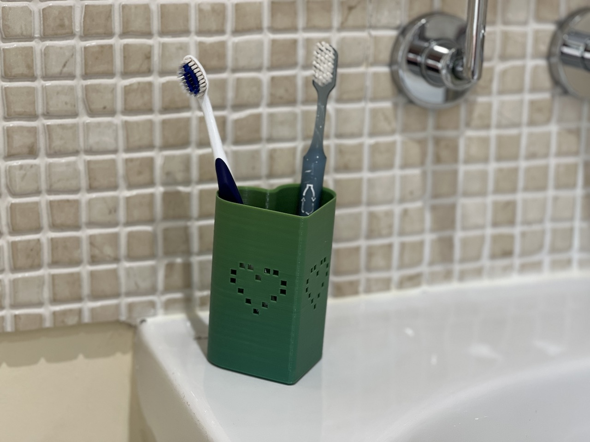
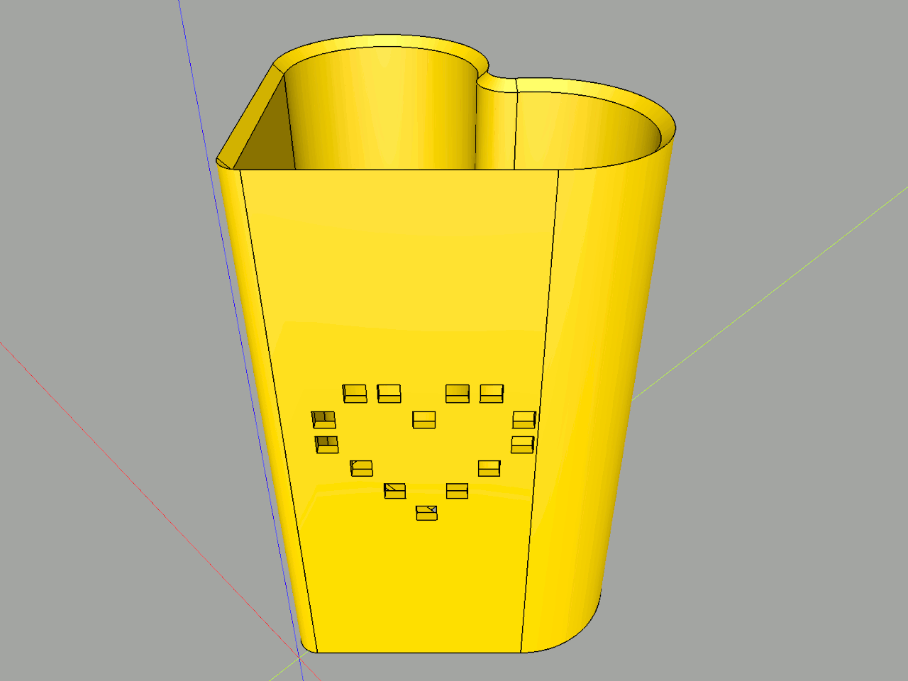
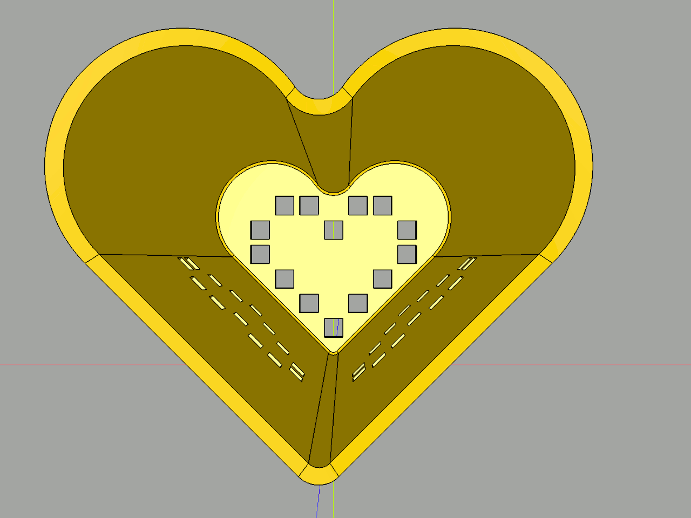
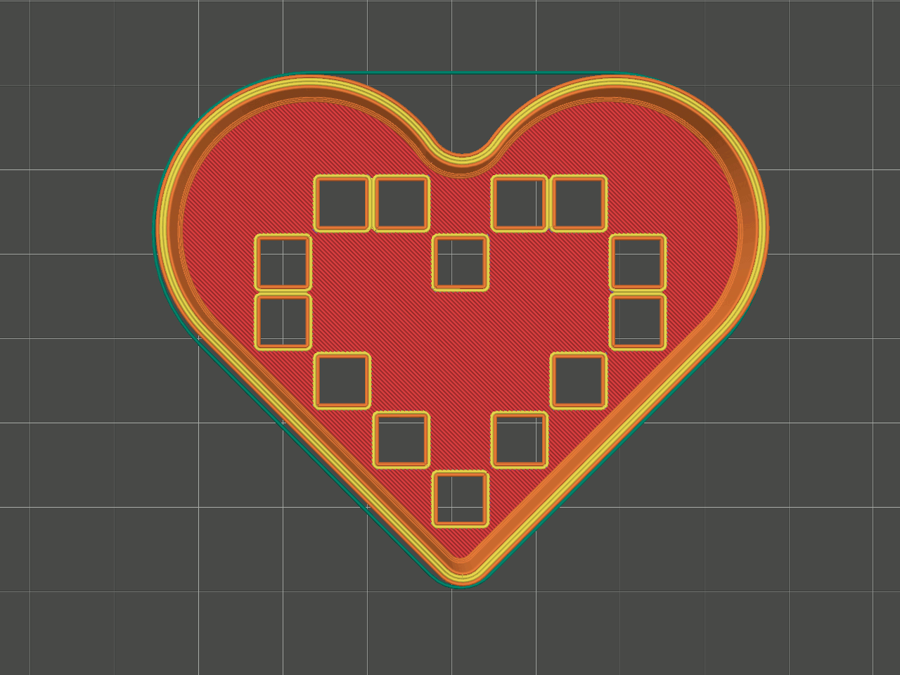

# Heart toothbrush holder

Are you looking for a cute and practical way to store your toothbrushes? Do you want to add some love and charm to your bathroom? Then you will love this 3D model of a toothbrush holder in a heart shape! This 3D model is easy to print and it can hold up to three toothbrushes of any size.

It has cute pixel hearts on the side that give it a retro and playful vibe. The heart shape will make your bathroom look more cozy and romantic, and it will also remind you to brush your teeth with care.

It has nice, smooth chamfers around the top:

It has cute pixel hearts on the bottom:

It's carefully designed to be printed with a 0.4 mm nozzle, 0.2 mm layer height and four top and bottom layers. Prusa Slicer slices the 1.67 mm walls into a strong four-line wall:

Download this model today and make your bathroom more lovely!

<https://www.printables.com/model/421099-heart-toothbrush-holder>

## License

CC0

## Author

Leon Brocard <acme@astray.com>
